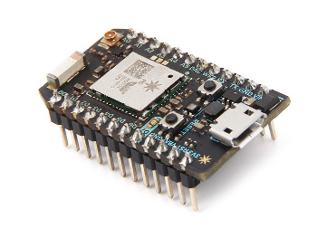

# KArgMap for IoT

A minimal footprint C++ equivalent of the JDDAC ArgMap structured data abstraction.



On this page:

- [KArgMap for IoT](#kargmap-for-iot)
  - [Introduction](#introduction)
  - [Example C++](#example-c)
    - [Basic Usage](#basic-usage)
    - [Flexible get semantics with numeric conversion on demand](#flexible-get-semantics-with-numeric-conversion-on-demand)
    - [Convenient initializer lists](#convenient-initializer-lists)
    - [Automatic forward and backward data versioning support](#automatic-forward-and-backward-data-versioning-support)
  - [CBOR Serialization](#cbor-serialization)
  - [Quick Start C++](#quick-start-c)
    - [Minimal Installation](#minimal-installation)
    - [Cmake Installation](#cmake-installation)
    - [Developer Installation](#developer-installation)
      - [Prerequisites](#prerequisites)
      - [Building and running unit tests](#building-and-running-unit-tests)
      - [Installation for Visual Studio](#installation-for-visual-studio)
  - [Performance](#performance)
  - [Custom Types](#custom-types)
    - [Custom Type Serialization](#custom-type-serialization)
  - [Architecture](#architecture)
  - [Questions/Feedback](#questionsfeedback)
  - [Licensing](#licensing)

---

## Introduction

These classes allow structured data to be easily represented and serialized over communications networks.

This implementation is a C++ version of the ArgMap .Net implementation with a minimal footprint designed for constrained and performance limited devices.  A basic KArgMap using numeric put and get values requires less than **10K on a Particle Photon** (g++ -Os).
In spite of the small size, use of standard c++ containers to represent KArgMap and KArgList provides a rich set of features comparable to the C# .Net version.

Features

- A single header file.  No .cpp files or build required.
- Support for standard C++ numeric types (e.g. int8_t, int16_t, int32_t, int64_t, uint8_t, uint16_t, uint32_t, uint64_t, float, double) as well as std::vector of basic types.
- A simple type-safe get and set interface for named values in a KArgMap.  Get access allows providing a default value to avoid try/catch or if/else logic if value is not present or incompatible with requested type.
- Automatic conversion for get operations. e.g. set as int16_t, get as string, float, or int32_t.
- Can be used on small footprint devices like the [Particle Photon](https://www.particle.io/products/hardware/photon-wifi-dev-kit) or Adafruit feathers.
- Serialization to JSON and CBOR included

More Features

- ordered list of values via KArgList
- Support for std::vector, std::complex, and std::string types
- Timestamp and duration support (via std::chrono).  See KTimestamp and KDuration types.
- Property Tree support via the ArgMap 'value' field provides transparent migration from scalar values to structured data for version compatibility.
- Construction and add with initializer lists
- deepCopy and duplicate
- const correctness
- Less than 16KB size (<10K compiled for smallest size)
- Custom User types

## Example C++

### Basic Usage

``` c++
#include "kargmap/KArgMap.hpp"
using namespace entazza;

KArgMap createSettings()
{
    KArgMap argMap { { "name", "Captain Kirk" } };  // initializer list
    argMap.set("occupation", "Starship Captain");   // set operator

    argMap["age"] = 85;  // array operator with assignment
    argMap["warpFactor"] = 7.8;

    std::cout << argMap << std::endl;  // log as json
    // {"name":"Captain Kirk", "occupation":"Starship Captain", "age":85, "warpFactor":7.8}
    return argMap;  // smart pointer copy
}

void applySettings(const KArgMap settings) {
    // settings.get(key, default_value).  Type inferred from default value if not specified.
    auto name = settings.get("name","unknown");
    auto job = settings.get("occupation","unknown");

    int32_t age = settings.get("age",0);
    double warpFactor = settings.get("warpFactor",0.0);

        // explicitly specify get return type
        float warpFactorF = settings.get<float>("warpFactor",0.0f);

    // convert to a json string
    auto json = settings.to_string();
}
```

### Flexible get semantics with numeric conversion on demand

To further assist with application stability, values can be retrieved as any convertable types.  If the value
cannot be converted, the provided default value is returned.  This also applies to fields that are not present - the default value is used.  Convoluted if/else/exception not required.

``` c++
KArgMap m;
m.set("range", -30); // store as integer in version1 of application
auto r1 = m.get<int>("range", 0); // get as an integer
ASSERT_EQ(-30, r1);

// Perhaps in version 2 range is now stored as a double.
m.set("range", -30.0);

//  v1 code continues to work and return an int when requested
// Return type is imputed from get usage hints
r1 = m.get<int>("range", 0); // get as an integer
auto r2 = m.get("range", 0.0);  // double because default is a double
auto r3 = m.get<double>("range", 0); // double because get<T> specified
auto r4 = m.get("range", double(0)); // double because default value is double
auto r5 = m.get("range", "error"); // get as a string

ASSERT_EQ(-30, r1);
ASSERT_EQ(-30.0, r2);
ASSERT_EQ(-30.0, r3);
ASSERT_EQ(-30.0, r4);
ASSERT_EQ("-30", r5);
```

When using the get method the type of the value returned is determined either by specifying the type explicitly using `get<T>(key,default_value)` or
by matching the type of the default value argument.  The type of the default value can be either explicitly cast or deduced from
it's inherent type.  e.g. ```get<int32_t>(key,0)```, ```get<double>(key,0.0)```, ```get(key,int64_t(0))``` ```get(key,float(1.2)```, ```get(key,0L)```, or ```get(key,0.0f)```.

### Convenient initializer lists

KArgMap and KArgList can be initialized with a simple list of key/value pairs for KArgMap or a list of values for KArgList.

``` c++
KArgMap m({ {"abc","abc"}, {"i32",1234}, {"map", KArgMap {{"x",1},{"y",2}} } });
ASSERT_EQ("abc", m.get("abc", "error"));
ASSERT_EQ(1234, m.get("i32", -1));

KArgList list({"abc",1234});
ASSERT_EQ("abc", list.get(0, "error"));
ASSERT_EQ(1234, list.get(1, -1));

KArgMap map = m.get("map", KArgMap());
ASSERT_EQ(1, map.get("x", -1));
ASSERT_EQ(2, map.get("y", -1));
```

### Automatic forward and backward data versioning support

The code below demonstrates version1 of a release which relied on a single scalar value for 'range'.
In version 2 it was found that additional meta data (e.g. units) was needed to describe range.  By
replacing 'range' with a map and placing range into the 'value' field of the map, V1 code continues
to work without modification even though range is now a structured type.

V1: { "range" : double; }
V2: { "range" : { double value; std::string units; } }

This allows system robustness by allowing a mixture
of versions to communicate key/value pairs easily.

``` c++
// In version1 we store 'range' as a plain double.
KArgMap version1;
version1.set("range", -30.0);
ASSERT_EQ("{\"range\":-30}", version1.to_string());

// In version2 it was realized that units meta data was needed.
// 'value' field is used for range 'value' with a sibling 'units' field.
KArgMap version2;
KArgMap range;
range.set("value", -30.0);
range.set("units", "dBm");
version2.set("range", range); // range is now stored as KArgMap key/value pairs
ASSERT_EQ("{\"range\":{\"value\":-30, \"units\":\"dBm\"}}", version2.to_string());

// Version1 code can read a version2 encoded range without any code changes (and vice versa)
ASSERT_EQ(version1.get("range", 0.0), version2.get("range", 0.0));

auto v1Range = version1.get("range", 0.0);
auto v2Range = version2.get("range", 0.0);  // old code still works for "range"
auto v2Units = version2.get("range|units", "V"); // new code can access units if present

"range|units" shows how structured data can be traversed without querying individual elements along
a path.

ASSERT_EQ(-30.0, v1Range);
ASSERT_EQ(-30.0, v2Range);
ASSERT_EQ("dBm", v2Units);
```

## CBOR Serialization

CBOR (Concise Binary Object Representation) is an Internet standard encoding for structured data defined in [RFC7049](https://tools.ietf.org/html/rfc7049). It defines how various types of data used in programming can be encoded to a stream of bytes to be exchanged over an IPC or communication medium.

“The Concise Binary Object Representation (CBOR) is a data format whose design goals include the possibility of extremely small code size, fairly small message size, and extensibility without the need for version negotiation.”

A helper class is provided to allow serializing KArgMap to and from [CBOR](https://cbor.io).

For example the following data structure in JSON notation can be serialized to binary and deserialized from binary by utilizing CBOR encoding provided by this library.

JSON:

```json
{"name": "Glenn", "count": 1234}
```

BINARY CBOR in Hex:

```txt
a2646e616d6565476c656e6e65636f756e741904d2
```

CBOR Decoded:

```txt
A2               # map(2)
   64            # text(4)
      6E616D65   # "name"
   65            # text(5)
      476C656E6E # "Glenn"
   65            # text(5)
      636F756E74 # "count"
   19 04D2       # unsigned(1234)
```

```c++
#include <kargmap/CborSerializer.hpp>
KArgMap myArgMap;
myArgMap["name"] = "Glenn";
myArgMap["count"] = 1234;
uint8_t buf[50];
CborSerializer serializer(buf, sizeof(buf));
serializer.encode(myArgMap);
auto bytesSerialized = serializer.bytesSerialized();
```

An example CBOR encode/decode operation can be seen in [an example](examples/cbor/CborExample.cpp).

The CBOR serializer can also be used in a two-pass method where the first pass is used to allocate
an output buffer of sufficient size:

```c++
CborSerializer serializer(0,0);  // allocate no space
serializer.encode(myArgMap);  // encode with insufficient space - will calc size needed
auto bytesRequired = serializer.bytesRequired();
uint8_t buf[bytesRequired];
serializer.initBuffer(buf, bytesRequired);
serializer.encode(myArgMap);  // success
```

More details are available on CBOR at [https://cbor.io](https://cbor.io).

Support for CBOR serialization is based on the [MicroCbor project](https://github.com/glenne/microcbor).

## Quick Start C++

The C++ version requires modern C++ circa C++11.  It utilizes a number of standard libary features such as

- std::unordered_map
- std::vector

### Minimal Installation

1. Download [KArgMap.hpp](include/kargmap/KArgMap.hpp)
2. Add it to your project
3. Enjoy

### Cmake Installation

```cmake
cmake_minimum_required(VERSION 3.14.0)
set(CMAKE_CXX_STANDARD 11)

#==============================================================================
# Load KArgMap from git
include(FetchContent)

FetchContent_Declare(
  kargmap
  GIT_REPOSITORY https://github.com/glenne/kargmap.git
  GIT_TAG        main
)
FetchContent_MakeAvailable(kargmap)
#==============================================================================

add_executable(KArgMapExample
               KArgMapExample.cpp
              )
target_link_libraries(KArgMapExample
     KArgMap
     KArgMapCbor
)
```

### Developer Installation

#### Prerequisites

Cmake - Download and install from [cmake.org](https://cmake.org/download/).  Cmake 3.14.0 or above.


#### Building and running unit tests

This example shows commands for Linux.  Add the appropriate changes for Visual Studio.

1. From kargmap/, create a build directory and navigate into it

`$ mkdir build && cd build`

2. Run cmake and specify flag to generate unit tests

`$ cmake -DBUILD_KARGMAP_TESTS=ON ..` or `$ cmake -DBUILD_ALL_TESTS=ON ..`

3. Run make

`$ make`

4. Run Tests

`$ test/KArgMapTest`

#### Installation for Visual Studio

The following steps assume ssume Visual Studio 15.

1) From kargmap/, create a build directory and navigate into it
`$ mkdir build && cd build`

1) Run cmake
`$ cmake -G "Visual Studio 15" ..`

## Performance

The table below shows an access speed comparison of a number of C++ container implementations.
Each implementation has their own set of unique features but the set value / get value is provided in all.

Configuration:

- Test A: Create container, fill it with 12 parameters, convert to const (or immutable), read 8 parameters
- Test B: Same as A but the container is only created once (if possible)
- Loops: 100000
- ITERATIONS: 10 (10 iterations of 100000 container r/w tests)

| Container          | A (usec) | B (usec) |
| ------------------ | -------- | -------- |
| std::unordered_map | 2.25     | 0.71     |
| entazza::KArgMap   | 2.51     | 1        |

Notes:

- std::unordered_map<std::string,boost::variant<...>> is just a container and does not have any type-safe 'helpers' to get values out of the container easily.
- const std::string or equivalent are used for map key access rather than raw quoted strings.
- times are approximate on the machine doing the testing.  Processor caching and other effects may influence the results.

## Custom Types

The KArgMap and KArgList containers support adding user defined types.  In order to distinguish between the built-in supported types and user defined
types the custom types use setCustomType() and getCustomType() methods instead of set() and get().  The getCustomType() method will confirm
the requested type is the same type as stored in the KArgMap or KArgList and return a default value if the types do not match.

``` c++
KArgMap m;
MyCustomType mt(12345,"world");
m.setCustomType("mytype", mt);

auto myType = m.getCustomType("mytype", MyCustomType());
ASSERT_EQ(12345, myType.i);
ASSERT_EQ("world", myType.s);

KArgList list;
list.addCustomType(mt);
auto myType5 = list.getCustomType(0, MyCustomType());
ASSERT_EQ(12345, myType5.i);
ASSERT_EQ("world", myType5.s);
```

getCustomType() can leave off the default value but the type must be conveyted using a template argument.  When the
default value is not provided and type requested value is not available, the default constructor of the type is used to provide the default value.

``` c++
auto myType = m.getCustomType<MyCustomType>("mytype");  // KArgMap

auto myType5 = list.getCustomType<MyCustomType>(0); // KArgList
```

The KArgList and KArgMap implementations assume that custom user types can be stored by value and a copy constructor is available.
If the type is not suitable for storage by value it can be wrapped with `std::shared_ptr<T>` in which case the shared_ptr is stored by value
and appropriate reference counts incremented and decremented as necessary.  Of course, when retrieving the value, a
shared_ptr instance will be returned with the ref count incremented.

``` c++
auto sh = std::make_shared<MyCustomType>(54321,"shared");
ASSERT_EQ(1, sh.use_count());
m.setCustomType("sh", sh);  // ref count bump when adding to KArgMap
ASSERT_EQ(2, sh.use_count());

auto shptr = m.getCustomType<std::shared_ptr<MyCustomType>>("sh");
ASSERT_EQ(true, bool(shptr));  // nullptr check
ASSERT_EQ(54321, shptr->i);
ASSERT_EQ("shared", shptr->s);
ASSERT_EQ(3, sh.use_count());
```

### Custom Type Serialization

Custom types can be serialized when a serialization helper has been registered with KArgMap.  The Serialization helper must
be able to compose a KArgMap that represents the serializable state of the type as well as compose an instance of the custom type
from a KArgMap.

For a custom type to participate in serialization, a registration call must be made and two static methods must be provided.

1. Implement a method to serialize to a KArgMap

    static KArgMap toArgMap(const MyCustomType *value);

2. Implement a method to create your custom type from a KArgMap

    static MyCustomType fromArgMap(const KArgMap& map);

3. Implement a method to return a string for deserializers to recognize your custom type

    static std::string argMapTypeName();

4. Register the custom type using

    KArgUtility::registerCustomType<T,SerializerHelper>();

An example class is below:

``` c++
class MyCustomType
{
public:
    int i;
    std::string s;
    MyCustomType(int i, const std::string s) : i(i), s(s) {}
    MyCustomType() : i(0), s("") {}

    static KArgMap toArgMap(const MyCustomType *value)
    {
        return KArgMap({{"i", value->i}, {"s", value->s}});
    }
    static MyCustomType fromArgMap(const KArgMap& map)
    {
        MyCustomType value;
        value.i = map.get("i", value.i);
        value.s = map.get("s", value.s);
        return value;
    }
    static std::string argMapTypeName() { return "Test:MyCustomType"; }
};

static auto myCustomTypeSerializeInit = KArgUtility::registerCustomType<MyCustomType>();
```

In this example the conversion helpers are part of the type itself.  The conversion helpers can also be a
separate class in which case a 2nd template argument can be used:

``` c++
static auto myCustomTypeSerializeInit = KArgUtility::registerCustomType<MyCustomType,MyCustomTypeSerializerHelper>();
```

## Architecture

The KArgMap and KArgList classes are modeled after the JDDAC Java implementations of these classes.  In particular, the notion that the KArgList and KArgMap container classes
can contain a fixed set of scalar values (numerics, bool, strings), arrays (std::vector), and other KArgList and KArgMap entities.

KArgMap and KArgList themselves use std::unordered_map and std::vector internally and present a subset of delegated methods to do iteration and manipulation (e.g. clear).

The programming model where get methods are used with default values for error conditions is used for an exceptionless programmer experience.  In addition, conversion between
numeric types is permitted on a best effort basis.  If a conversion overflow would occur, the provided defaultValue is returned.

One of the design goals was to make use of the KArgMap/KArgList abstraction as easy as possible.  This resulted in a single header file design as well as
friendly getters and setters.

KArgMap and KArgList have a single member variable that is a smart pointer that envelopes the underlying map or list implementation.  This allows reference sharing
with just a smart pointer copy.  This also facilitates storage of KArgMap and KArgList within other KArgMap and KArgList containers as the user of a KArgMap
never needs to worry about freeing or destroying memory.  This also holds true for `std:vector<T>` objects placed into one of these containers.  They are stored
with a smart pointer.  When a `std::vector<T>` is added to a KArgMap or KArgList it must either use std::move to transfer ownership or it must provide a std::shared_ptr.

The KArgMap and KArgList containers can be cast to const versions with zero overhead.  A const version will return const references to container type elements.  This allows
the programmer to use 'const KArgMap&' as a parameter to functions.

To facilitate use in threaded environments, a deepClone() method is provided which duplicates the contents by creating new containers for all children and children's children
in a KArgMap structure.  `std::vector<T>` elements are not duplicated.   A future 'cloneAll' or 'duplicate' method will be provided that will also duplicate std::vector<T>
elements.

## Questions/Feedback

Contact [Glenn Engel](mailto://glenne@engel.org) for help, suggestions, or feedback.

## Licensing

The KArgMap API was leveraged from the JDDAC work done by Agilent Technologies and is licensed under the Three Clause BSD License.
